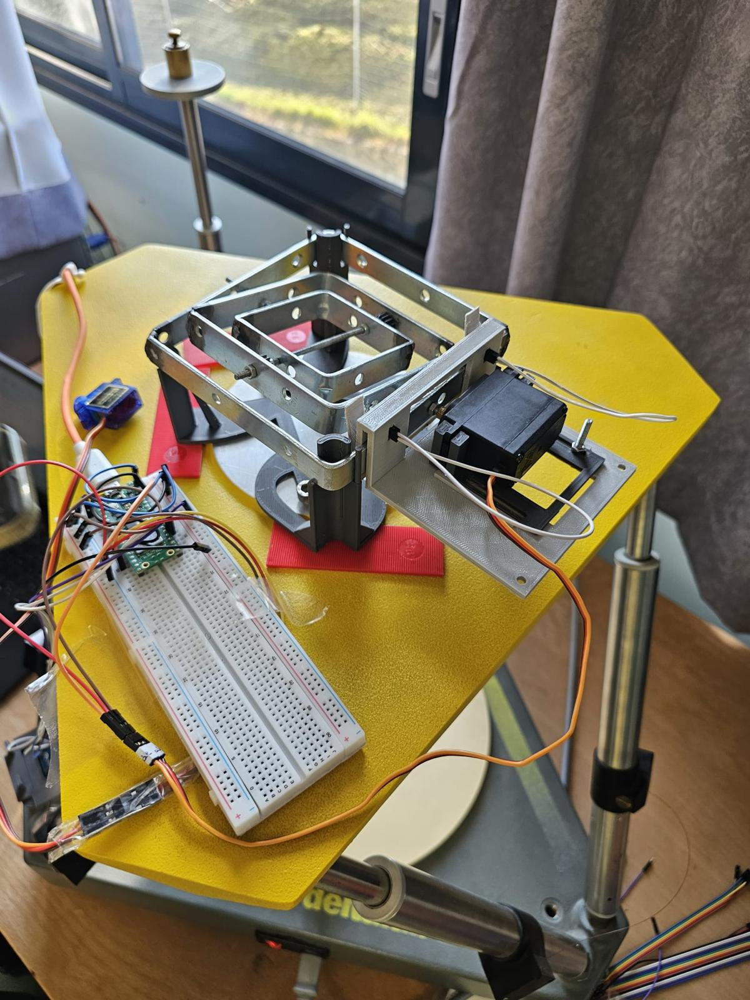

  

Stabilisation Active d'une Plateforme

Conception, construction et stabilisation active d’une plateforme à l’aide d’un capteur inertiel MPU-6050, d'un servomoteur, d’un Raspberry Pi Pico WH et d’un asservissement PID.

Ce dépôt présente la partie logicielle et l'analyse de données de mon projet de TIPE réalisé en binôme avec Clarence Jutier en prépa PSI. Le but est de programmer un système capable de stabiliser dynamiquement une plateforme matérielle que nous avons construite.

Contexte et Objectifs
Le projet global s'inspire des systèmes d'amortissement du génie civil, comme la tour Taipei 101, et de la compensation de la houle pour les navires. Mon rôle s'est concentré sur le développement informatique et le traitement des signaux pour maintenir la plateforme horizontale malgré les perturbations.
L'objectif logiciel est de traiter les données d'un capteur inertiel MPU-6050.
Ensuite, il faut piloter des servomoteurs avec un microcontrôleur pour compenser l'inclinaison de la maquette.
La logique globale est gérée par une boucle d'asservissement PID.

Architecture Logicielle (Dossier src)
Le code embarqué tourne sur une carte Raspberry Pi Pico WH et est développé en MicroPython.
Traitement mathématique : L'algorithme utilise les quaternions pour calculer les angles d'Euler.
Filtrage : Un filtre complémentaire permet de fusionner les données de l'accéléromètre et du gyroscope, ce qui élimine le bruit et la dérive du capteur.
Asservissement : Le correcteur PID calcule la commande à envoyer aux moteurs pour corriger l'écart angulaire, avec un temps d'échantillonnage constant (cycles) pour assurer la stabilité.
Actionnement : Les corrections sont générées sous forme de signaux PWM envoyés aux servomoteurs de la structure.

Analyse des Résultats (Dossier data_analyses)
Pendant que le système fonctionne, le microcontrôleur envoie les données télémétriques en temps réel sur le port série.
Des scripts Python récupèrent ces informations avec la bibliothèque PySerial et les stockent automatiquement sous forme de fichiers CSV.
Pour fluidifier l'exploitation, tout le système de traitement a été automatisé : il suffit d'un simple clic pour exécuter le script qui lit les données, les traite et génère instantanément les graphiques 'matplotlib' comparant l'inclinaison brute et l'angle corrigé par le servo.
Cette automatisation a grandement facilité l'analyse de l'efficacité de la boucle et l'ajustement expérimental des coefficients Kp et Ki du correcteur.
Pour valider la robustesse du code, les tests ont été réalisés sur une plateforme de Stewart simulant des trajectoires dynamiques (séismes, houle).

Documentation

- [Synthèse scientifique du TIPE](docs/Synthèse_scientifique_du_TIPE.pdf)
- [Présentation du TIPE](docs/Présentation_TIPE.pdf)

Répartition du travail

Ce projet a été réalisé en binôme avec Clarence Jutier.

Ma contribution s'est principalement concentrée sur le système embarqué,
le traitement des données, l'asservissement PID et l'analyse expérimentale.

La conception mécanique et la CAO de la plateforme ont principalement été
réalisées par Clarence Jutier.

---
Steve TEKOMBONG
